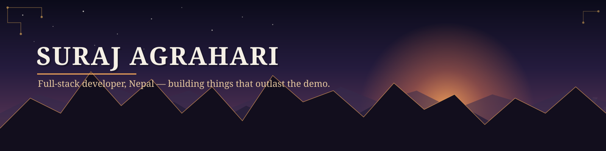

<div align="center">




<br/>

<a href="https://github.com/suraz404">
  
</a>
<div align="center">
  
  
</div>

<p>
  <a href="https://www.linkedin.com/in/suraj-agrahari-982a272a9/"></a>
  <a href="mailto:surazagrahari1980@gmail.com"></a>
  
</p>

</div>

<br/>


## 🟢 Developer status

```text
╭──────────────────────────────────────────────╮
│ 🟢 STATUS: ONLINE                             │
├──────────────────────────────────────────────┤
│ 👨‍💻 CURRENTLY: Building & leveling up          │
│ 🚀 FOCUS: Full stack → Cloud → DevOps         │
│ 🧠 LEARNING: AI-integrated applications        │
│ 📍 BASE: Nepal                                │
│ ☕ POWERED BY: Curiosity + coffee               │
╰──────────────────────────────────────────────╯
```

<br/>

## ✋Who is this


I'm Suraj , a full-stack developer based in Nepal who builds products end to end, from the first commit to something real people can open in a browser. My core stack is JavaScript, TypeScript, React, Next.js, Node.js, Express, MongoDB, and Zustand for state — and I'm currently pushing further into cloud infrastructure, DevOps, and AI-integrated applications.

I'm less interested in collecting frameworks than in shipping things that solve an actual problem, ideally one grounded in a real context rather than a hypothetical one.


<br/>

## 🎯 Mission control

| Mission                                  | Status              |
|-------------------------------------------|---------------------|
| Become elite at full-stack development     | 🟢 IN PROGRESS       |
| Build products people actually use         | 🚀 ACTIVE            |
| Master cloud & DevOps                      | 🟡 LEVELING UP        |
| Contribute to open source                  | 🟣 QUEST AVAILABLE    |
| Build something legendary                  | 🔥 NEVER ENDING       |

<br/>


<br/>

## 🧠 The tech universe


```text
                        JAVASCRIPT / TYPESCRIPT
                                 │
          ┌──────────────────────┼──────────────────────┐
          │                      │                      │
      FRONTEND               BACKEND               CLOUD / DEVOPS
          │                      │                      │
      React.js               Node.js                 Docker
      Next.js                Express                 AWS
      Zustand                MongoDB                 Linux
      Tailwind CSS
```


<div align="center">


</div>

<br/>

## 🗺️ Build log

```text
2024 ─────── Started seriously exploring web development
   │
2025 ─────── Built projects using React and modern frontend tools
   │
2026 ─────── Next.js, TypeScript, Zustand, and real-world products
   │
NOW  ─────── Leveling up full-stack engineering + shipping new builds
   │
NEXT ────── Cloud · DevOps · Open source · Bigger products
```

<br/>

## 📊 The numbers

<div align="center">

<!-- ═══════════════ HEADER TROPHIES ═══════════════ -->


<br/><br/>

<!-- ═══════════════ MAIN STATS & STREAK ═══════════════ -->

<a href="https://github.com/suraz404">
  
</a>

<br/><br/>

<!-- ═══════════════ TOP LANGUAGES & PRODUCTIVE TIME ═══════════════ -->
<a href="https://github.com/suraz404">
  
</a>
<a href="https://github.com/suraz404">
  
</a>

<br/><br/>

<!-- ═══════════════ DETAILED PROFILE GRAPH ═══════════════ -->


</div>

<br/>

## 📡 Live Activity

<!--START_SECTION:activity-->
1. 🟢 **Pushed 0 commits** to [`suraz404/Nodejs`](https://github.com/suraz404/Nodejs)
2. 🟢 **Pushed 0 commits** to [`suraz404/suraz404`](https://github.com/suraz404/suraz404)
<!--END_SECTION:activity-->

<br/>

<div align="center">


<!-- ═══════════════ VISITOR COUNTER ═══════════════ -->


</div>
<br/>
## 🏆 Achievements

```text
[⚡ Fast learner]
Unlocked: React → Next.js → TypeScript → backend systems

[🚀 Product builder]
Unlocked: Built and shipped real projects

[🧠 Curious mind]
Unlocked: Permanently

[🔥 Consistency mode]
Progress: ███████░░░ 70%

[🌍 Future global developer]
Status: Loading...
```

<br/>

## 💭 Developer philosophy

> I don't want to just write code.
> I want to build things that people remember.

<br/>

## 📡 Open source radar

```text
Looking for:

→ Interesting React / Next.js / TypeScript projects
→ Beginner-friendly open-source contributions
→ AI-powered products
→ Developer tools
→ Collaborations with ambitious builders
```

<br/>

## 💡 Random developer fact

```text
The number of bugs in my code is directly proportional
to how confident I was before running it.
```

<br/>

## 🎉 You unlocked the endgame

Thanks for scrolling this far. You are officially part of the repository.

```bash
git clone friendship
cd collaboration
npm install awesome-ideas
```

> Got an idea worth building?
> **Let's turn it into something real.**

<div align="center">

<a href="https://www.linkedin.com/in/suraj-agrahari-982a272a9/"></a>
<a href="mailto:surazagrahari1980@gmail.com"></a>

<br/><br/>


</div>
